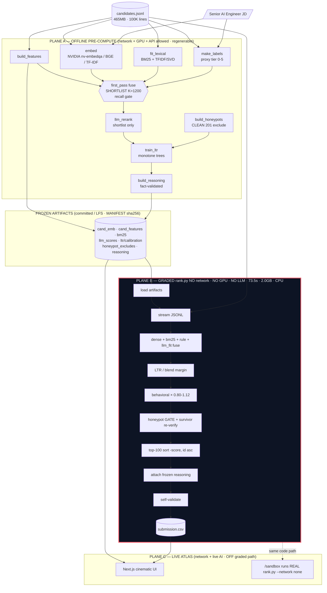

# IndiaRuns / ATLAS — Intelligent Candidate Discovery & Ranking

**Track 1 — India Runs × Redrob AI (Data & AI Challenge).** ATLAS ranks 100,000
candidates against a Senior AI Engineer JD the way a great recruiter would: by career
**evidence**, not stuffed keywords — and it proves, with a network-namespace-removed
Docker run and a byte-for-byte determinism hash, that the graded step is a pure-numpy,
CPU-only, offline pass that finishes in **73.5 seconds** well inside the 5-minute cap.

---

## The problem, and the trap

The pool is a needle-in-a-haystack: only **998 candidates (1.0%)** carry an AI/ML
*title*, but **20,381 (20.4%)** list at least one AI/ML *skill*. That **19.4-point gap**
is the trap surface — Marketing Managers, HR Managers and Mechanical Engineers who
stuffed "Vector Search", "RAG" and "Fine-tuning LLMs" into their skills array. The
shipped `sample_submission.csv` is the deliberately-**wrong** baseline: it ranks an HR
Manager and a Content Writer #1–#4 purely on AI-skill count.

**The keyword-trap insight:** a keyword count cannot tell a builder from a buzzword.
ATLAS inverts that instinct three ways — it embeds the career **narrative** (not the
skills list), it reads ranking/retrieval/recsys **evidence in the job descriptions**
(not the skills array), and it applies a hard multiplicative cap (`×0.15`) the moment a
non-engineering title is paired with an AI skill. Evidence beats title; a "Data Engineer"
who actually shipped retrieval outranks a "Recommendation Systems Engineer" who is
structurally impossible.

---

## The three-plane architecture

ATLAS is split into three planes with one inviolable rule: **no network, GPU, or LLM call
ever sits on the graded (Plane B) rank-time path.** Everything expensive happens offline
in Plane A and is frozen to artifacts; the graded ranker only loads and fuses them.

| Plane | What | Where | Constraints |
|---|---|---|---|
| **A — Offline pre-compute** (`precompute/`) | embeddings, BM25/TF-IDF fit, deterministic features, recall first-pass → shortlist, LLM re-rank, monotone LTR / blend calibration, frozen reasoning, web artifacts | dev box / Vertex; network + GPU + APIs allowed; time-unbounded; fully regenerable | declared in `submission_metadata.yaml` + `artifacts/MANIFEST.json` |
| **B — Graded ranker** (`rank.py`, `core/`, `features.py`, `reasoning.py`) | loads frozen artifacts, streams `candidates.jsonl`, fuses sub-scores, applies behavioral multiplier + honeypot gate, writes the top-100 CSV with frozen reasoning, self-validates | sandbox Docker `--network none` | **CPU-only · ≤5 min · ≤16 GB RAM · ≤5 GB disk · NO network** |
| **C — Live product (ATLAS web)** (`web/`) | cinematic Next.js UI: JD intake, ranking cinema, shortlist board, evidence cards, honeypot reveal, recruiter co-pilot | Cloud Run / Hugging Face Space; network + APIs allowed | reads Plane-B **outputs**; never invokes `rank.py` online; fully functional with zero keys |



The pipeline (DESIGN-level): **retrieval finds the candidates, an LLM judges the few that
matter, a monotone-constrained blender fuses the evidence, and a structural gate
guarantees no trap survives — all frozen offline so the graded step is a sub-90-second
pure-numpy pass.**

---

## How to run

### Reproduce the submission (the graded path)

Works out-of-the-box from a fresh clone — the 100-line stratified real sample and its
matching frozen artifacts (`artifacts_sample/`) are committed:

```bash
pip install -r requirements-rank.txt
python rank.py --candidates data/sample_candidates.jsonl \
  --out ./submission.csv --artifacts artifacts_sample
python validate_submission.py ./submission.csv      # -> "Submission is valid."
```

Full pool: the large frozen arrays for the 100K pool (`artifacts/candidate_index.json`
plus the `*.npy` / `*.npz` binaries) are regenerable and **not committed**. Supply
`candidates.jsonl`, regenerate the Plane-A artifacts once (see *Regenerate artifacts*
below), then run the default paths:

```bash
python rank.py --candidates ./candidates.jsonl --out ./submission.csv   # --artifacts ./artifacts
python validate_submission.py ./submission.csv
```

`rank.py` reads only frozen artifacts (never downloads anything) and runs the vendored
validator on its own output before it writes — it refuses to emit a non-conforming file.
If the full `artifacts/` are absent it exits early with an actionable message pointing to
the sample command above and to `precompute/run_all.py`.

### Prove the no-network / CPU / budget claims

```bash
# 1) Network namespace removed — produces a valid CSV offline
docker run --rm --network none --cpus=4 --memory=16g -v "$PWD/out:/out" indiaruns-sandbox

# 2) Determinism — two runs are byte-identical
make reproduce        # docker run --network none, twice, then diff

# 3) Full proof bundle: timing harness + budget check + no-socket test + determinism
make prove
```

Verified results from the real full pool:

- **Wall-clock 73.5 s** (`/usr/bin/time -v`) vs the 300 s cap → 4.1× headroom.
- **Peak RSS 2.01 GB** vs the 16 GB cap → 8× headroom.
- **Byte-identical** across runs and the committed file:
  `sha256 = 694f86dd462772b7884e18e5b47a04e6b828f12abc91636c78c23b1b98cc457f`.
- `docker run --network none` produced a valid CSV with **no network reachable at all**.

### Web demo (Plane C)

```bash
cd web && npm install && npm run dev      # http://localhost:3000
```

The web app reads the four shipped artifacts in `web/public/artifacts/`
(`ranked_top100.json`, `funnel.json`, `rejected_traps.json`, `intent.json`). Its
`/sandbox` route runs the **real** `rank.py` in-container on the 100-line sample with the
subprocess network disabled and a live timer — the same code that writes the submission.
The product is fully functional and visually identical with **zero** API keys; live
co-pilot / intent / outreach degrade to a deterministic brain with an honest status pill.

### Regenerate artifacts (Plane A, optional)

```bash
pip install -r requirements-precompute.txt
python data/prepare_data.py --source /path/to/candidates.jsonl
python precompute/run_all.py --candidates ./candidates.jsonl --artifacts ./artifacts
```

With `NVIDIA_API_KEY` set, Plane A uses NVIDIA hosted embeddings + a large instruct
model for re-rank. With the `claude` CLI available it uses that as a live judge. With neither, it
degrades to local BGE embeddings (or TF-IDF/SVD) + a deterministic brain. **Every
degradation level still produces a valid, honeypot-clean submission** — keys are quality
multipliers, never dependencies.

---

## Verified results (real full 100K pool)

| Metric | Value | Bound / baseline |
|---|---|---|
| `rank.py` wall-clock | **73.5 s** | cap 300 s (4.1× headroom) |
| `rank.py` peak RSS | **2.01 GB** | cap 16 GB (8× headroom) |
| Compute | **CPU-only, no network** | proven via `--network none` Docker |
| Determinism | **byte-identical** | `sha256 694f86dd…cc457f` |
| Validator | **"Submission is valid."** | 100 rows, ranks 1–100 unique, score non-increasing, ties id-ascending |
| Honeypots in top-100 / top-10 | **0 / 0** | 201 clean ids hard-excluded |
| Shortlist recall gate | **PASS** | proxy-Tier-5 100% (700/700), Tier-4 100% (216/216) inside K=1200 |
| Real LLM judgments | **299** on the top-300 shortlist | 294 LLM-written + fact-validated reasoning lines |
| Fusion decision | **ship BLEND** | 5-fold CV-NDCG@10 blend 1.0000 vs LTR 0.766 (ship-the-safer-one) |
| Internal NDCG@10 vs naive keyword baseline | **~1.00 vs ~0.07** | synthetic proxy, relative sanity check only |

Tier distribution over 100K: **T0** 43,961 · **T1** 25,035 · **T2** 5,978 · **T3** 24,110
· **T4** 216 · **T5** 700. Full numbers, the validator transcript, and the
NDCG-vs-baseline table are in [`docs/results.md`](docs/results.md).

**Top-10 (all genuine ranking / search / recsys engineers at product companies):**
`CAND_0046525` Sr ML Eng @ Genpact AI (LinkedIn RAG ranking, 50M q/mo) ·
`CAND_0024466` Search Eng @ PharmEasy (L2R search) ·
`CAND_0041669` Recsys Eng @ CRED (LTR + RAG eval) ·
`CAND_0075439` ML Eng @ Flipkart (prod RAG, 10M recsys) ·
`CAND_0026532` Recsys Eng @ Zomato ·
`CAND_0070485` Search Eng @ Saarthi.ai (L2R @ Dream11, FAISS) ·
`CAND_0053591` AI Eng @ Ola ·
`CAND_0011432` Sr DS @ Amazon ·
`CAND_0051615` Search Eng @ Meta ·
`CAND_0076251` Search Eng @ Haptik.

---

## Honeypot defense

Defense-in-depth, all deterministic, all on the rank path.

- **Layer 1 — frozen hard-exclude gate (`final = −∞`).** `honeypot_excludes.json` is the
  **clean 201-id union** of high-precision *structural-impossibility* signatures only:
  `too_many_experts` (167), `career_sum_exceeds_yoe` (24), `expert_zero_duration` (21),
  `tenure_exceeds_company_age` (3), `career_span_exceeds_yoe` (3), plus 0-hit chronology
  guards. The briefing expects ~80 planted traps; 201 is a safe superset at negligible
  recall cost.
- **Layer 2 — live re-verify of survivors.** `rank.py` re-runs the clean structural checks
  (pure-python, microseconds) on every candidate that reaches the top-300 by margin and
  gates any that trip a signature — robust even if the hidden pool reorders.
- **Layer 3 — top-10 paranoia.** Each top-10 slot must additionally have zero clean
  signatures and at least one real career-evidence hit.

**Two critical non-checks.** Salary inversion `min > max` fires on **18,865 (18.9%)** — a
**dataset norm**, deliberately NOT flagged; excluding it would nuke a fifth of the pool.
The `-1` sentinels `github_activity_score` (64.6%) and `offer_acceptance_rate` (59.6%)
mean "no data" and **never** penalize. The two noisy signatures
(`skill_duration_exceeds_career` 9,231, `edu_degree_order_impossible` 4,715) are demoted
to soft features, never a hard gate. Full rationale in
[`docs/honeypot_defense.md`](docs/honeypot_defense.md).

---

## NVIDIA, GCP & Claude usage

- **NVIDIA (Plane A only).** Hosted endpoints at build.nvidia.com — `nv-embedqa`
  embeddings and a large instruct model for shortlist re-rank and per-candidate
  reasoning. The `precompute/nvidia_client.py` path is shipped and selected automatically
  when `NVIDIA_API_KEY` is set. Never touches the rank path.
- **Claude (dev + Plane A judge).** Architecture, code authoring/review, docs, and the
  deck were produced with Claude; the `claude` CLI also serves as a live offline-build LLM
  judge backend (this run produced **299 real judgments** with it).
- **GCP (Plane C deploy, documented).** Cloud Run (`asia-south1` Mumbai) + Artifact
  Registry + Secret Manager + an optional Vertex Custom Job for Plane A, all via
  `infra/bootstrap.sh` / `infra/main.tf` / `cloudbuild.yaml`. No secret is needed to build
  any image; the key is read at API runtime only. Deployment is credential-gated and never
  required to merge or test.

The whole pipeline runs end-to-end with **no NVIDIA key and no GCP creds** — local
embeddings + rule-proxy + deterministic reasoning still yield a valid, honeypot-clean
submission. See [`docs/blueprint.md`](docs/blueprint.md) and the metadata's honest
`ai_usage_summary`.

---

## Repo map

```
IndiaRuns/
├── rank.py                  # PLANE B entrypoint (--candidates --out [--mode fast|self-contained])
├── features.py              # shared D≈40 feature extractor (Plane A & B; no train/serve skew)
├── reasoning.py             # deterministic fact-assembly (fallback + guarantee)
├── validate_submission.py   # vendored contest validator (also run in-process by rank.py)
├── core/                    # io_jsonl · schema · keywords · honeypot · rule_fit · subscores
│                            #   gbdt · calibrate · gate · score · artifacts
├── precompute/              # PLANE A: build_features · embed · fit_lexical · make_labels
│                            #   first_pass_shortlist · llm_rerank · train_ltr · build_honeypots
│                            #   build_reasoning · build_web_artifacts · nvidia_client · run_all
├── artifacts/               # frozen artifacts + MANIFEST.json (sha256 + producer + size)
├── data/                    # prepare_data · make_sample · sample_candidates.jsonl (100 real lines)
├── web/                     # PLANE C: Next.js 14 App Router ATLAS UI + public/artifacts/
├── docker/                  # Dockerfile.{ranker,sandbox,api,web} + nginx.conf
├── spaces/ infra/ cloudbuild.yaml   # HF Space + GCP IaC + Cloud Build
├── scripts/                 # timing_harness · check_budget · assert_no_honeypots · netguard
├── tests/                   # validator · determinism · no_network · sentinels · gate · budget · …
├── docs/                    # blueprint · architecture · honeypot_defense · anti_trap_reasoning
│                            #   reproducibility · results · data_card · interview_prep
├── deck/                    # slides + speaker notes + PDF
└── .github/workflows/       # ci.yml · web.yml · deploy.yml
```

Artifact shipping: small text/JSON committed directly; `*.npy`/`*.npz`/`*.parquet` via Git
LFS; the 465 MB `candidates.jsonl` is `.gitignore`d (fetched by `data/prepare_data.py`;
the sandbox uses the 100-line sample). The default `rank.py` fast path works from
`git clone` + `git lfs pull` with no network and no Plane-A rerun.

---

## Documentation index

- [`docs/blueprint.md`](docs/blueprint.md) — full methodology end to end.
- [`docs/architecture.md`](docs/architecture.md) — five mermaid diagrams (system map,
  data/artifact flow, rank.py runtime path, honeypot layers, the funnel).
- [`docs/honeypot_defense.md`](docs/honeypot_defense.md) — clean-201 set, the
  salary-inversion correction, layers 1–3.
- [`docs/anti_trap_reasoning.md`](docs/anti_trap_reasoning.md) — the AI-keyword trap,
  role-fit logic, the `×0.15` cap, evidence > title.
- [`docs/reproducibility.md`](docs/reproducibility.md) — single command, determinism,
  no-network / CPU / budget proof, artifact manifest.
- [`docs/results.md`](docs/results.md) — timing, RAM, validator, honeypot=0, determinism
  hash, tier distribution, recall, NDCG-vs-baseline, top-20.
- [`docs/data_card.md`](docs/data_card.md) — dataset profile, sentinels, trap surface.
- [`docs/interview_prep.md`](docs/interview_prep.md) — Stage-5 defend-your-work Q&A.

---

## License

MIT — see [`LICENSE`](LICENSE). All code is the team's original work; AI tools were used
as documented in `submission_metadata.yaml`.
