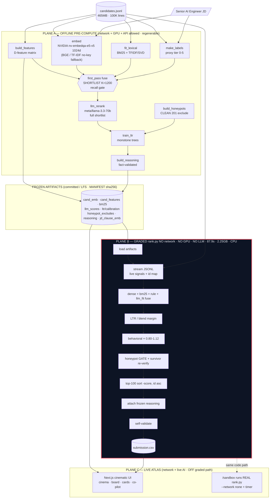
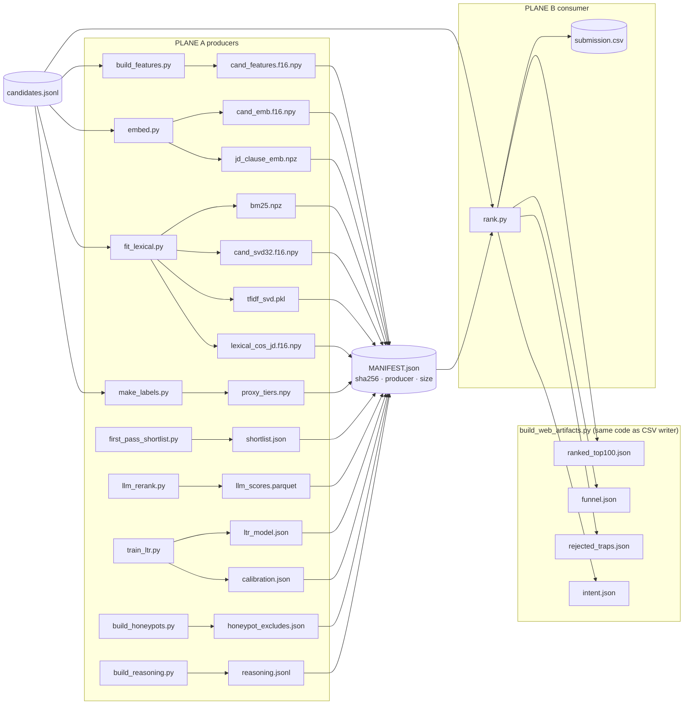
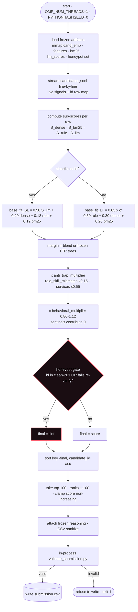
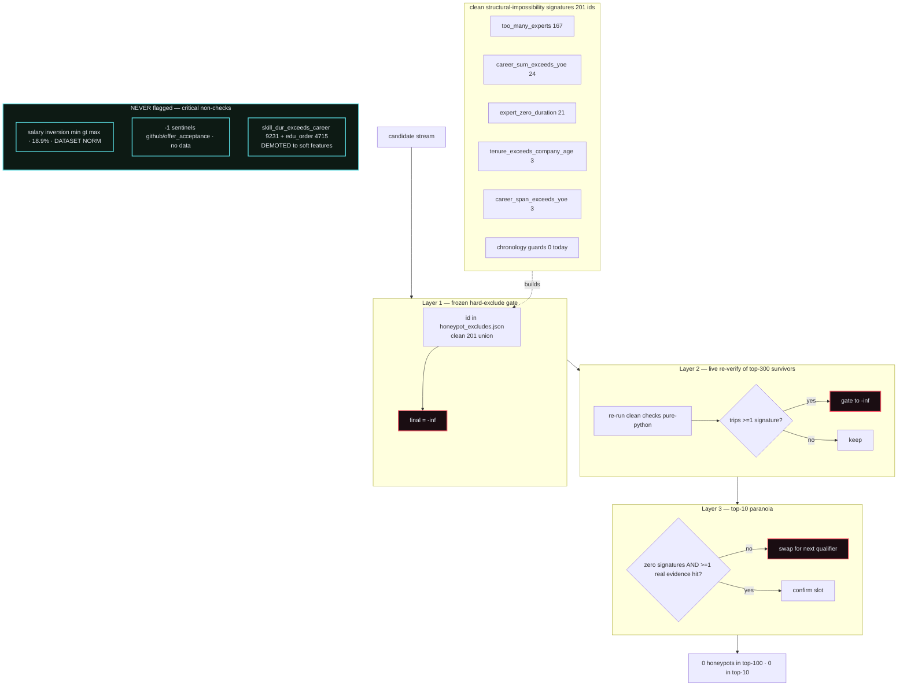
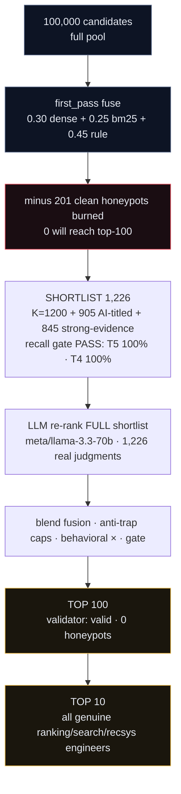

# Architecture — five diagrams

ATLAS is three planes joined by frozen artifacts. The diagrams below render natively on
GitHub. For the prose methodology see [`blueprint.md`](blueprint.md).

---

## 1. Three-plane system map

The one inviolable rule — no network / GPU / LLM on the graded path — is the red-bordered
Plane B.

---

## 2. Data / artifact flow

Each Plane-A script writes a declared artifact; `rank.py` consumes them; `MANIFEST.json`
records sha256 + producer + size for every one.

---

## 3. rank.py runtime path

The graded step: load, stream, fuse, gate, sort, attach, validate, write. No network, no
GPU, no LLM — measured 87.9 s / 2.25 GB on the full 100K.

---

## 4. Honeypot defense layers

Defense-in-depth, all deterministic, with the two critical non-checks called out.

---

## 5. The funnel

100,000 → shortlist 1,226 → LLM-judged full shortlist → top 100 → top 10, with the trap
burn in the middle.

